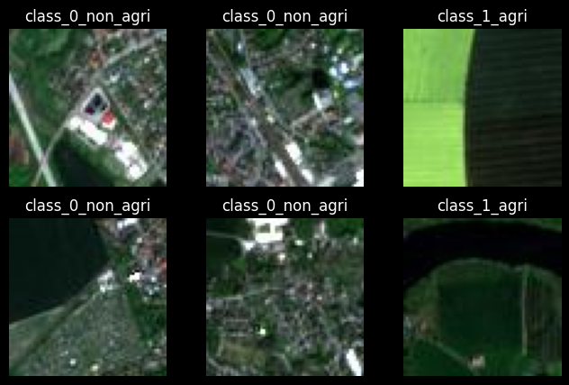
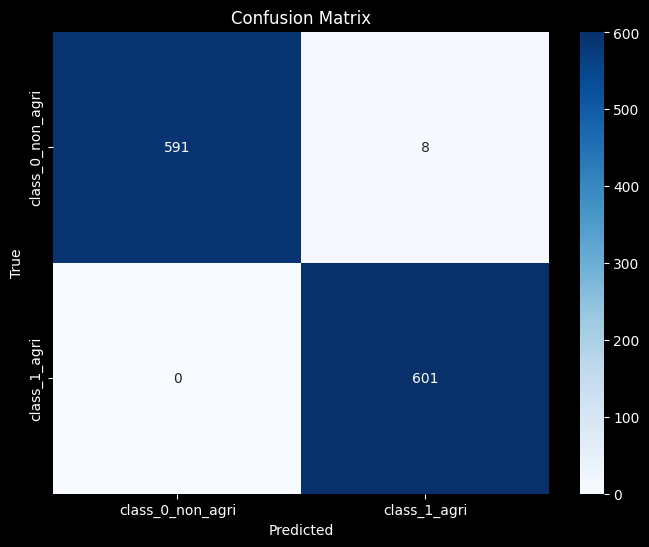

# Agricultural Land Classification

This project performs geospatial land classification using satellite imagery. It implements a hybrid deep learning approach that combines **Convolutional Neural Networks (CNNs)** with a **Vision Transformer (ViT)** backbone to leverage both local feature extraction and global context for improved classification accuracy.

**Dataset**
- Satellite imagery organized into two classes: `class_0_non_agri` and `class_1_agri` (see `images_dataSAT/`).

**Implementations**
- Hybrid model (CNN + ViT) implemented in both TensorFlow (Keras) and PyTorch.
- Notebooks included:
	- `hybrid_cnn_and_vit_keras.ipynb` — Keras/TensorFlow implementation and training.
	- `hybrid_cnn_and_vit_pytorch.ipynb` — PyTorch implementation and training.
	- `model_building_keras.ipynb` and `model_building_pytorch.ipynb` — supporting model-building experiments.

**Data Augmentation**
- Extensive augmentation applied to improve generalization, including random flips, rotations, color jitter, random crops/rescaling, and other geometric and photometric transforms. Augmentations are applied during training pipelines in both framework implementations to reduce overfitting and increase robustness to seasonal/lighting variations.

**Training Details (summary)**
- Hybrid architecture: CNN encoder(s) for low-level/local features + ViT module for capturing global relationships between image patches.
- Loss and metrics: binary cross-entropy (or equivalent), accuracy, and confusion matrix evaluation.
- Regularization: augmentation, weight decay, and early stopping (used during experiments).

**Results**
- Example data samples:

	

- Example confusion matrix (evaluation of final model):

	

- Observations:
	- The hybrid CNN+ViT model improved detection of small agricultural plots by combining local convolutional detail with transformer-based global context.
	- Data augmentation noticeably increased validation performance and reduced overfitting compared to non-augmented baselines.

**Project assets**
- Example images used in this README are stored in the `assets/` directory.

**Notes**
- This repository contains both TensorFlow and PyTorch experiments for comparison; refer to the notebooks for training hyperparameters, exact augmentation pipelines, and model checkpoints.

